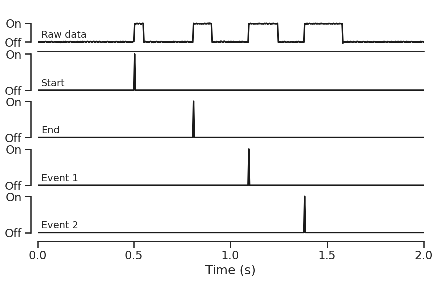

SyncMaster
================

<!-- WARNING: THIS FILE WAS AUTOGENERATED! DO NOT EDIT! -->

This file will become your README and also the index of your
documentation.

## Installation

``` sh
pip install syncmaster
```

## Example application

Fill me in please! Don’t forget code examples:

``` python
# Import library
import syncmaster

# Create device object
device = syncmaster.SyncMaster()

# Run trial with start and end signals
device.start()    # Send start signal

''' Run behavioural task '''

device.end()      # Send end signal

# Close communication channel when finished
device.close()
```

## Output


